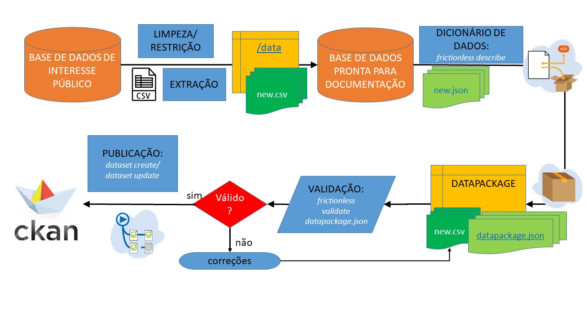

# Ciclo de Abertura, Documentação, Validação e Publicação

Após a escolha da base, seguem as etapas de preparação técnica da base para publicação, como representadas no esquema sintético a seguir:

As etapas de documentação, validação e publicação contam com o auxílio de ferramentas de linha de comando (CLI) para automatização do trabalho, customizadas pela DCTA. 

Tais ferramentas necessitam de instalação e configuração, cujas instruções podem ser acessadas [aqui](https://github.com/dados-mg/dados-mg.github.io/blob/main/setup-maquina-windows.md). 

Oportunamente, a [instância do CKAN em produção que comporta o Portal de Dados Abertos](www.dados.mg.gov.br) poderá ter a incorporação dessas ferramentas na sua interface gráfica (GUI), conforme explicado nas Oficinas de Capacitação em Abertura de Dados (ocorridas em 10/05), da Semana Mineira de Controle Interno (2023).

## Limpeza de Dados

Esta etapa tem o objetivo de oferecer informação íntegra aos usuários. A limpeza não se constitui, necessariamente, uma primeira etapa de uma sequência ordenada de ações. Ela usualmente é necessária após a documentação, ou validação dos dados, na medida em que forem identificadas incorreções, incompletudes ou inadequações com os metadados descritos. 

Exemplos: padronização do formato de valores de colunas (siglas, números, datas, unidades de medida); inclusão ou exclusão de colunas para padronização do layout dos arquivos.

Na figura a seguir, temos algumas inadequações na planilha de remuneração:

- Falta de padrão para valores:

    - na 2ª coluna: Valores abreviados 'SD 1 CL' e outros por extenso;

    - na 3ª coluna: zero ('0'), vazios ('') e 'sim';

    - na 5ª coluna: valor 'CBMMG' (nome do órgão abreviado) e outros nomes por extenso;

    - na 7ª coluna: separadores de milhar e de decimais para remuneração
    
- Formatos de número a serem descritos para valores de carga horária, na 6ª coluna; 

- Formato de descrição da data (última coluna): necessidade de descrição no datapackage.json (como %d%m%a)

A responsabilidade pela limpeza dos dados deve ser da área produtora (ou custodiante). Um guia sugestivo de problemas comuns de limpeza de dados responsável, pode ser encontrado [na Escola de Dados da Open Knowledge Brasil](https://escoladedados.org/tutoriais/guia-quartz-para-limpeza-de-dados/).

O guia divide o tipo de problema pelo responsável indicado para resolvê-lo, como, por exemplo:

* problemas que a fonte dos dados deve resolver: faltam valores, linhas duplicadas, formatos de datas inconsistentes, unidades de medida não  estão especificadas, categorias estão mal escolhidas, origem não está documentada, nomes de campos estão ambíguos, texto foi convertido em números, números foram guardados como texto;

* problemas que o usuário dos dados deve resolver: dados foram editados manualmente, escala de tempo foi manipulada, inflação distorce os dados, amostra não é aleatória, amostra é enviesada, margem de erro é muito grande, margem de erro é desconhecida, 

## Restrição de Informações

Esta etapa visa resguardar informações que tenham restrição de acesso, em atendimento à Lei de Acesso à Informação (LAI, Capítulo IV) e à Lei Geral de Proteção de Dados (LGPD). 

É realizada com ações de substituir, omitir, anonimizar caracteres, textos e dados, que contenham informações sensíveis e/ou restritas.

As decisões sobre restringir informações são balizadas pela análise caso-a-caso e devem contar com a análise dos especialistas de cada área temática ou política pública.

O [Guia de Boas Práticas da LGPD](https://www.gov.br/governodigital/pt-br/seguranca-e-protecao-de-dados/guias/guia_lgpd.pdf), publicado pelo Comitê Central de Governança de Dados, traz algumas definições e estratégias para identificar a necessidade e aplicar técnicas de anonimização e pseudonimização.

Segundo o Guia:

* anonimizado _é o dado que, considerados os meios técnicos razoáveis no momento do tratamento, perde a possibilidade de associação, direta ou indireta, a um indivíduo._

* pseudonimização _é a técnica de tratar dados pessoais de uma forma em que os dados somente possam ser atribuídos a um titular de dados mediante a utilização de informações adicionais, não disponíveis a todos, desde que essas informações sejam mantidas em ambiente separado, controlado e seguro. A título ilustrativo, criptografia é um método de pseudonimização, quando os dados somente podem ser atribuídos a um titular mediante o conhecimento da chave criptográfica_

Ainda segundo a Autoridade Nacional de Proteção de Dados (ANPD), em [NT sobre a divulgação dos microdados do censo escolar](https://www.gov.br/anpd/pt-br/documentos-e-publicacoes/sei_00261-000730_2022_53-nt-46.pdf), que podem balizar a avaliação de riscos e mitigar possibilidades de identificação de pessoas físicas:

> 6.2. A anonimização não é uma medida de segurança que deve ser adotada em todo e qualquer tratamento de dados pessoais, pois a LGPD não a elegeu como condição técnica para a divulgação pública ou para o compartilhamento de dados pessoais por entidades e órgãos públicos. Em realidade, a principal determinação da LGPD é quanto à necessidade de avaliação de riscos e de adoção de medidas para mitigar a ocorrência de danos. Por esta razão, a eventual identificação dos titulares ou a admissão de algum grau de risco de sua identificação, quando necessário para atender, por exemplo, a determinações legais, o interesse público e o direito de acesso à informação, são compatíveis com a LGPD, desde que adotadas as salvaguardas apropriadas.

Outro exemplo de restrição de dados pessoais, e acessível no Portal da Transparência, é a **descaracterização** do nome e do CPF dos ganhadores de prêmios lotéricos. Nesse caso, a técnica de descaracterização aplicada teve a intenção de impossibilitar a identificação dos vencedores dos prêmios lotéricos, para que a sua eventual identificação, ou reidentificação, não fosse um risco potencial à sua segurança.

