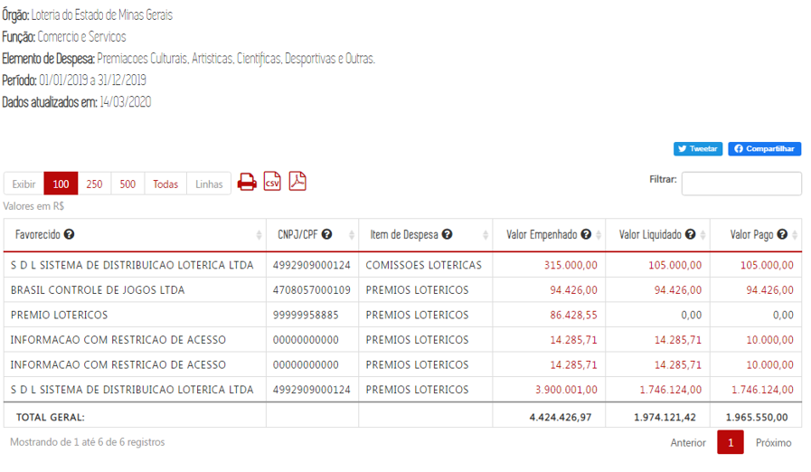

# Restrição de Informações

Esta etapa visa resguardar informações que tenham restrição de acesso, em atendimento à Lei de Acesso à Informação (LAI, Capítulo IV) e à Lei Geral de Proteção de Dados (LGPD). 

É realizada com ações de substituir, omitir, anonimizar caracteres, textos e dados, que contenham informações sensíveis e/ou restritas.

As decisões sobre restringir informações são balizadas pela análise caso-a-caso e devem contar com a análise dos especialistas de cada área temática ou política pública.

[^]
	-	Enunciado AGE março de 2022 

O [Guia de Boas Práticas da LGPD](https://www.gov.br/governodigital/pt-br/seguranca-e-protecao-de-dados/guias/guia_lgpd.pdf), publicado pelo Comitê Cetral de Governança de Dados, traz algumas definições e estratégias para identificar a necessidade e aplicar técnicas de anonimização e pseudonimização.

Segundo o Guia:

* anonimizado _é o dado que, considerados os meios técnicos razoáveis no momento do tratamento, perde a possibilidade de associação, direta ou indireta, a um indivíduo._

* pseudonimização _é a técnica de tratar dados pessoais de uma forma em que os dados somente possam ser atribuídos a um titular de dados mediante a utilização de informações adicionais, não disponíveis a todos, desde que essas informações sejam mantidas em ambiente separado, controlado e seguro. A título ilustrativo, criptografia é um método de pseudonimização, quando os dados somente podem ser atribuídos a um titular mediante o conhecimento da chave criptográfica_

[^ ]

Ainda segundo a Autoridade Nacional de Proteção de Dados (ANPD), em [NT sobre a divulgação dos microdados do censo escolar](https://www.gov.br/anpd/pt-br/documentos-e-publicacoes/sei_00261-000730_2022_53-nt-46.pdf)

> 6.2. A anonimização não é uma medida de segurança que deve ser adotada em todo e qualquer tratamento de dados pessoais, pois a LGPD não a elegeu como condição técnica para a divulgação pública ou para o compartilhamento de dados pessoais por entidades e órgãos públicos. Em realidade, a principal determinação da LGPD é quanto à necessidade de avaliação de riscos e de adoção de medidas para mitigar a ocorrência de danos. Por esta razão, a eventual identificação dos titulares ou a admissão de algum grau de risco de sua identificação, quando necessário para atender, por exemplo, a determinações legais, o interesse público e o direito de acesso à informação, são compatíveis com a LGPD, desde que adotadas as salvaguardas apropriadas.

Outro exemplo de restrição de dados pessoais, eacessível no Portal da Transparência, é a **descaracterização** do nome e do CPF dos ganhadores de prêmios lotéricos. Nesse caso, a técnica de descaracterização aplicada tem a intenção de impossibilitar a identificação dos vencedores dos prêmios lotéricos, para que a sua eventual identificação, ou reidentificação, não fosse um risco potencial à sua segurança.

